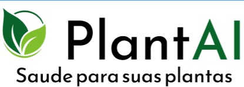
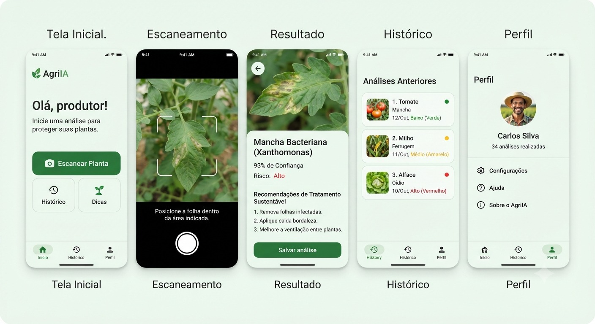
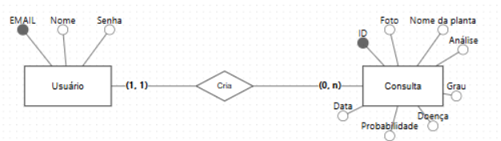

# 🌱 PlantAI

> Sistema inteligente para diagnóstico de doenças em plantas utilizando Inteligência Artificial.

<p align="center">
  
</p>

<p align="center">


</p>

---

## 📖 Sobre o projeto

O **PlantAI** é uma aplicação mobile desenvolvida durante o **Hackathon da PUC Minas** com o objetivo de auxiliar agricultores, produtores rurais e cultivadores na identificação precoce de doenças em plantas utilizando Inteligência Artificial.

Por meio da captura de uma imagem, o sistema realiza uma análise da planta, identifica possíveis doenças, apresenta o nível de confiança da IA e fornece recomendações para auxiliar no tratamento e prevenção.

---

## 🎯 Objetivos

- Facilitar o diagnóstico de doenças em plantas;
- Auxiliar produtores na tomada de decisão;
- Reduzir perdas agrícolas;
- Incentivar práticas sustentáveis;
- Contribuir para os Objetivos de Desenvolvimento Sustentável (ODS).

---

## 📱 MVP

Nesta primeira versão do projeto, serão implementadas as seguintes funcionalidades:

- Login de usuários;
- Captura ou upload de imagem da planta;
- Diagnóstico utilizando Inteligência Artificial;
- Exibição da confiança da análise;
- Recomendações de tratamento;
- Histórico das análises;
- Perfil do usuário.

---

## 🖼️ Protótipo

<p align="center">

</p>

---

## 🗃️ Modelagem do Banco de Dados

<p align="center">

</p>

---

## 🚀 Tecnologias Utilizadas

### Mobile

- React Native
- Expo
- TypeScript

### Backend

- Node.js
- Express

### Banco de Dados

- PostgreSQL

### Inteligência Artificial

- API de IA para análise de imagens *(em definição)*

---

## 📂 Estrutura do Projeto

```text
PlantAI
│
├── backend/
│
├── frontend/
│
├── database/
│
├── docs/
│   ├── images/
│   ├── prototipo/
│   ├── mer/
│   └── apresentacao/
│
├── README.md
├── LICENSE
└── .gitignore
```

---

## ⚙️ Como executar

### Clone o repositório

```bash
git clone https://github.com/GuilhermeValbonetti/PlantAi.git
```

### Backend

```bash
cd backend
npm install
npm run dev
```

### Frontend

```bash
cd frontend
npm install
npx expo start
```

---

## 📋 Requisitos Funcionais

- RF01 – Realizar login;
- RF02 – Escanear uma planta através de imagem;
- RF03 – Processar a imagem utilizando IA;
- RF04 – Exibir diagnóstico;
- RF05 – Exibir recomendações;
- RF06 – Salvar análises no histórico;
- RF07 – Consultar análises anteriores.

---

## 🔒 Requisitos Não Funcionais

- Interface intuitiva;
- Aplicação responsiva;
- Persistência dos dados;
- Autenticação de usuários;
- Arquitetura escalável;
- Integração com Inteligência Artificial.

---

## 🌎 Objetivos de Desenvolvimento Sustentável

Este projeto contribui para os seguintes Objetivos de Desenvolvimento Sustentável da ONU:

- 🌱 ODS 12 – Consumo e Produção Responsáveis;
- 🌳 ODS 15 – Vida Terrestre.

---

## 📌 Roadmap

- [x] Definição da ideia
- [x] Prototipação
- [ ] Modelagem do banco de dados
- [ ] Desenvolvimento Backend
- [ ] Desenvolvimento Mobile
- [ ] Integração com IA
- [ ] Testes
- [ ] Apresentação Final

---

## 👨‍💻 Equipe

| Integrante | Função |
|------------|--------|
| Guilherme Vinicius | Desenvolvedor |
| Yallison Faria | Desenvolvedor |
| Jonathan Rubens | Desenvolvedor |
| Marcus Vinicius | Desenvolvedor |
| Ramon José | Desenvolvedor |
| Matheus Oliveira | Desenvolvedor |

---

## 📄 Licença

Este projeto foi desenvolvido para fins acadêmicos durante o Hackathon da PUC Minas.
